<h1 align="center">基于机器学习的 WebShell 检测<span class="tocSkip"></span></h1>
<div class="toc"><ul class="toc-item"><li><span><a href="#预处理" data-toc-modified-id="预处理-1"><span class="toc-item-num">1&nbsp;&nbsp;</span>预处理</a></span><ul class="toc-item"><li><ul class="toc-item"><li><span><a href="#将文件夹中的图像，js脚本，css样式筛选出去" data-toc-modified-id="将文件夹中的图像，js脚本，css样式筛选出去-1.0.1"><span class="toc-item-num">1.0.1&nbsp;&nbsp;</span>将文件夹中的图像，js脚本，css样式筛选出去</a></span></li><li><span><a href="#将文件统一编码为utf-8" data-toc-modified-id="将文件统一编码为utf-8-1.0.2"><span class="toc-item-num">1.0.2&nbsp;&nbsp;</span>将文件统一编码为utf-8</a></span></li><li><span><a href="#对列表中的文件进行去重" data-toc-modified-id="对列表中的文件进行去重-1.0.3"><span class="toc-item-num">1.0.3&nbsp;&nbsp;</span>对列表中的文件进行去重</a></span></li><li><span><a href="#将不在列表中的文件从buf中移除" data-toc-modified-id="将不在列表中的文件从buf中移除-1.0.4"><span class="toc-item-num">1.0.4&nbsp;&nbsp;</span>将不在列表中的文件从buf中移除</a></span></li><li><span><a href="#创建文件预处理流水线对文件进行处理" data-toc-modified-id="创建文件预处理流水线对文件进行处理-1.0.5"><span class="toc-item-num">1.0.5&nbsp;&nbsp;</span>创建文件预处理流水线对文件进行处理</a></span></li></ul></li></ul></li><li><span><a href="#创建特征" data-toc-modified-id="创建特征-2"><span class="toc-item-num">2&nbsp;&nbsp;</span>创建特征</a></span><ul class="toc-item"><li><ul class="toc-item"><li><span><a href="#统计文章长度" data-toc-modified-id="统计文章长度-2.0.1"><span class="toc-item-num">2.0.1&nbsp;&nbsp;</span>统计文章长度</a></span></li><li><span><a href="#计算文章的熵值" data-toc-modified-id="计算文章的熵值-2.0.2"><span class="toc-item-num">2.0.2&nbsp;&nbsp;</span>计算文章的熵值</a></span></li><li><span><a href="#统计文章最长的单词" data-toc-modified-id="统计文章最长的单词-2.0.3"><span class="toc-item-num">2.0.3&nbsp;&nbsp;</span>统计文章最长的单词</a></span></li><li><span><a href="#统计文章中恶意词汇的数量" data-toc-modified-id="统计文章中恶意词汇的数量-2.0.4"><span class="toc-item-num">2.0.4&nbsp;&nbsp;</span>统计文章中恶意词汇的数量</a></span></li><li><span><a href="#计算文章的可压缩比例" data-toc-modified-id="计算文章的可压缩比例-2.0.5"><span class="toc-item-num">2.0.5&nbsp;&nbsp;</span>计算文章的可压缩比例</a></span></li><li><span><a href="#将特征提取过程打包" data-toc-modified-id="将特征提取过程打包-2.0.6"><span class="toc-item-num">2.0.6&nbsp;&nbsp;</span>将特征提取过程打包</a></span></li></ul></li></ul></li><li><span><a href="#处理数据" data-toc-modified-id="处理数据-3"><span class="toc-item-num">3&nbsp;&nbsp;</span>处理数据</a></span><ul class="toc-item"><li><ul class="toc-item"><li><span><a href="#将数据从文件夹读取出来" data-toc-modified-id="将数据从文件夹读取出来-3.0.1"><span class="toc-item-num">3.0.1&nbsp;&nbsp;</span>将数据从文件夹读取出来</a></span></li><li><span><a href="#创建标签" data-toc-modified-id="创建标签-3.0.2"><span class="toc-item-num">3.0.2&nbsp;&nbsp;</span>创建标签</a></span></li><li><span><a href="#计算各个文件的特征值" data-toc-modified-id="计算各个文件的特征值-3.0.3"><span class="toc-item-num">3.0.3&nbsp;&nbsp;</span>计算各个文件的特征值</a></span></li><li><span><a href="#将特征集合在一起，生成一个DataFrame" data-toc-modified-id="将特征集合在一起，生成一个DataFrame-3.0.4"><span class="toc-item-num">3.0.4&nbsp;&nbsp;</span>将特征集合在一起，生成一个DataFrame</a></span></li><li><span><a href="#查看前五条数据" data-toc-modified-id="查看前五条数据-3.0.5"><span class="toc-item-num">3.0.5&nbsp;&nbsp;</span>查看前五条数据</a></span></li><li><span><a href="#查看数据的整体状况" data-toc-modified-id="查看数据的整体状况-3.0.6"><span class="toc-item-num">3.0.6&nbsp;&nbsp;</span>查看数据的整体状况</a></span></li><li><span><a href="#查看数据中两种数据所占比例" data-toc-modified-id="查看数据中两种数据所占比例-3.0.7"><span class="toc-item-num">3.0.7&nbsp;&nbsp;</span>查看数据中两种数据所占比例</a></span></li><li><span><a href="#有三个特征格式不正确，进行转换" data-toc-modified-id="有三个特征格式不正确，进行转换-3.0.8"><span class="toc-item-num">3.0.8&nbsp;&nbsp;</span>有三个特征格式不正确，进行转换</a></span></li></ul></li></ul></li><li><span><a href="#分析数据" data-toc-modified-id="分析数据-4"><span class="toc-item-num">4&nbsp;&nbsp;</span>分析数据</a></span><ul class="toc-item"><li><ul class="toc-item"><li><span><a href="#导入画图的库" data-toc-modified-id="导入画图的库-4.0.1"><span class="toc-item-num">4.0.1&nbsp;&nbsp;</span>导入画图的库</a></span></li><li><span><a href="#将各个特征以图形化的界面展现出来" data-toc-modified-id="将各个特征以图形化的界面展现出来-4.0.2"><span class="toc-item-num">4.0.2&nbsp;&nbsp;</span>将各个特征以图形化的界面展现出来</a></span></li><li><span><a href="#计算出各个参数之间的皮尔逊系数" data-toc-modified-id="计算出各个参数之间的皮尔逊系数-4.0.3"><span class="toc-item-num">4.0.3&nbsp;&nbsp;</span>计算出各个参数之间的皮尔逊系数</a></span></li><li><span><a href="#按shell占比例将数据均匀分开" data-toc-modified-id="按shell占比例将数据均匀分开-4.0.4"><span class="toc-item-num">4.0.4&nbsp;&nbsp;</span>按shell占比例将数据均匀分开</a></span></li><li><span><a href="#将X，Y分离" data-toc-modified-id="将X，Y分离-4.0.5"><span class="toc-item-num">4.0.5&nbsp;&nbsp;</span>将X，Y分离</a></span></li><li><span><a href="#载入性能考核函数，并对结果进行评定" data-toc-modified-id="载入性能考核函数，并对结果进行评定-4.0.6"><span class="toc-item-num">4.0.6&nbsp;&nbsp;</span>载入性能考核函数，并对结果进行评定</a></span></li></ul></li></ul></li><li><span><a href="#分类算法介绍" data-toc-modified-id="分类算法介绍-5"><span class="toc-item-num">5&nbsp;&nbsp;</span>分类算法介绍</a></span><ul class="toc-item"><li><span><a href="#最有影响力的十大数据挖掘算法中包含的分类算法" data-toc-modified-id="最有影响力的十大数据挖掘算法中包含的分类算法-5.1"><span class="toc-item-num">5.1&nbsp;&nbsp;</span>最有影响力的十大数据挖掘算法中包含的分类算法</a></span><ul class="toc-item"><li><span><a href="#k近邻算法" data-toc-modified-id="k近邻算法-5.1.1"><span class="toc-item-num">5.1.1&nbsp;&nbsp;</span>k近邻算法</a></span></li><li><span><a href="#SVM法" data-toc-modified-id="SVM法-5.1.2"><span class="toc-item-num">5.1.2&nbsp;&nbsp;</span>SVM法</a></span></li><li><span><a href="#决策树" data-toc-modified-id="决策树-5.1.3"><span class="toc-item-num">5.1.3&nbsp;&nbsp;</span>决策树</a></span></li><li><span><a href="#朴素贝叶斯" data-toc-modified-id="朴素贝叶斯-5.1.4"><span class="toc-item-num">5.1.4&nbsp;&nbsp;</span>朴素贝叶斯</a></span></li><li><span><a href="#神经网络" data-toc-modified-id="神经网络-5.1.5"><span class="toc-item-num">5.1.5&nbsp;&nbsp;</span>神经网络</a></span></li><li><span><a href="#逻辑回归" data-toc-modified-id="逻辑回归-5.1.6"><span class="toc-item-num">5.1.6&nbsp;&nbsp;</span>逻辑回归</a></span></li><li><span><a href="#随机森林" data-toc-modified-id="随机森林-5.1.7"><span class="toc-item-num">5.1.7&nbsp;&nbsp;</span>随机森林</a></span></li><li><span><a href="#adaboost" data-toc-modified-id="adaboost-5.1.8"><span class="toc-item-num">5.1.8&nbsp;&nbsp;</span>adaboost</a></span></li><li><span><a href="#xgboost" data-toc-modified-id="xgboost-5.1.9"><span class="toc-item-num">5.1.9&nbsp;&nbsp;</span>xgboost</a></span></li><li><span><a href="#gbdt+lr" data-toc-modified-id="gbdt+lr-5.1.10"><span class="toc-item-num">5.1.10&nbsp;&nbsp;</span>gbdt+lr</a></span></li></ul></li></ul></li><li><span><a href="#分类算法尝试" data-toc-modified-id="分类算法尝试-6"><span class="toc-item-num">6&nbsp;&nbsp;</span>分类算法尝试</a></span><ul class="toc-item"><li><ul class="toc-item"><li><span><a href="#K近邻法" data-toc-modified-id="K近邻法-6.0.1"><span class="toc-item-num">6.0.1&nbsp;&nbsp;</span>K近邻法</a></span></li><li><span><a href="#支持向量机" data-toc-modified-id="支持向量机-6.0.2"><span class="toc-item-num">6.0.2&nbsp;&nbsp;</span>支持向量机</a></span></li><li><span><a href="#决策树" data-toc-modified-id="决策树-6.0.3"><span class="toc-item-num">6.0.3&nbsp;&nbsp;</span>决策树</a></span></li><li><span><a href="#朴素贝叶斯分类" data-toc-modified-id="朴素贝叶斯分类-6.0.4"><span class="toc-item-num">6.0.4&nbsp;&nbsp;</span>朴素贝叶斯分类</a></span></li><li><span><a href="#随机森林" data-toc-modified-id="随机森林-6.0.5"><span class="toc-item-num">6.0.5&nbsp;&nbsp;</span>随机森林</a></span></li><li><span><a href="#ADABOOST" data-toc-modified-id="ADABOOST-6.0.6"><span class="toc-item-num">6.0.6&nbsp;&nbsp;</span>ADABOOST</a></span></li><li><span><a href="#XGBOOST" data-toc-modified-id="XGBOOST-6.0.7"><span class="toc-item-num">6.0.7&nbsp;&nbsp;</span>XGBOOST</a></span></li><li><span><a href="#GBDT+LR" data-toc-modified-id="GBDT+LR-6.0.8"><span class="toc-item-num">6.0.8&nbsp;&nbsp;</span>GBDT+LR</a></span></li><li><span><a href="#投票算法" data-toc-modified-id="投票算法-6.0.9"><span class="toc-item-num">6.0.9&nbsp;&nbsp;</span>投票算法</a></span></li></ul></li></ul></li><li><span><a href="#对随机森林进行参数优化测试" data-toc-modified-id="对随机森林进行参数优化测试-7"><span class="toc-item-num">7&nbsp;&nbsp;</span>对随机森林进行参数优化测试</a></span><ul class="toc-item"><li><ul class="toc-item"><li><span><a href="#Estimators参数调整" data-toc-modified-id="Estimators参数调整-7.0.1"><span class="toc-item-num">7.0.1&nbsp;&nbsp;</span>Estimators参数调整</a></span></li><li><span><a href="#features参数调整" data-toc-modified-id="features参数调整-7.0.2"><span class="toc-item-num">7.0.2&nbsp;&nbsp;</span>features参数调整</a></span></li></ul></li></ul></li><li><span><a href="#尾声" data-toc-modified-id="尾声-8"><span class="toc-item-num">8&nbsp;&nbsp;</span>尾声</a></span><ul class="toc-item"><li><ul class="toc-item"><li><span><a href="#确定最终模型并将训练结果存储起来" data-toc-modified-id="确定最终模型并将训练结果存储起来-8.0.1"><span class="toc-item-num">8.0.1&nbsp;&nbsp;</span>确定最终模型并将训练结果存储起来</a></span></li><li><span><a href="#读取模型的方法" data-toc-modified-id="读取模型的方法-8.0.2"><span class="toc-item-num">8.0.2&nbsp;&nbsp;</span>读取模型的方法</a></span></li></ul></li></ul></li></ul></div>

在360网络安全学院已经学习了很久了，对Web安全已经建立了一个系统的认识。而且自己一直对人工智能、机器学习这类东西蛮感兴趣的，而且一直在看《Hands On Machine Learning with Scikit Learn and TensorFlow》这本书，所以在做毕业设计时第一时间就想到了把机器学习和Web安全结合在一起。

现在有各种各样的马，一句话，加密，混淆。普通的WebShell检测工具发挥的作用已经适应不了险恶的网络环境了，因此就必须有更加厉害的识别工具。
下面是我对机器学习识别WebShell的一些思路，希望大家可以互通有无，共同进步。

首先从github上下载了很多木马文件，然后从一些开源CMS中提取出php文件。（如 CodeIgniter，Joomla，Mambo，phpmyadmin，typecho，WordPress）

# 预处理

### 将文件夹中的图像，js脚本，css样式筛选出去


```python
import os
from sklearn.base import BaseEstimator, TransformerMixin

class filters(BaseEstimator, TransformerMixin):

    def transform(self, path):
        newList = []
        filterExt = ["jpg", "jpeg", "png", "git", "js", "css", "ico", "jar", "md", "sql", "json", "twig"]
        for root, dirs, files in os.walk(path):
            for completeName in files:
                fileName, extension = os.path.splitext(completeName)
                if extension.lower() not in filterExt:
                    newList.append(os.path.join(root, completeName))
        return newList
```

> 不能给机器太大压力

### 将文件统一编码为utf-8


```python
import chardet

class convert_encode(BaseEstimator, TransformerMixin):
    
    def transform(self, lists):
        num = 0
        newList = []
        for x in lists:
            with open(x, "rb") as f:
                content = f.read()
                encode = chardet.detect(content)['encoding']
                if encode != "ascii":
                    content = content.decode("utf-8", "ignore")
                    num += 1
                else:
                    content = content.decode(encode, "ignore")
            filePath, fileName = os.path.split(x)
            bufPath = "buf/" + filePath[7:]
            if not os.path.exists(bufPath):
                os.makedirs(bufPath)
            with open(bufPath + "/" + fileName, "w") as f:
                f.write(content)
            newList.append(bufPath + "/" + fileName)
        print(len(lists), "个文件中", str(num), "个文件被统一编码，所有处理后的文件被放到buf下")
        return newList
```

> 方便后面对文件的处理和特征提取

### 对列表中的文件进行去重


```python
import hashlib

def get_md5(file_path):
    md5_obj = hashlib.md5()
    with open(file_path, 'rb') as f:
        md5_obj.update(f.read())
        return md5_obj.hexdigest()

class removal(BaseEstimator, TransformerMixin):

    def transform(self, all_files):
        num = 0
        all_md5 = []
        new_list =[]
        for files in all_files:
            file_md5 = get_md5(files)
            if file_md5 not in all_md5 and (file_md5 != -1):
                all_md5.append(file_md5)
                new_list.append(files)
            else:
                num += 1
        print("一共有", str(num), "个重复文件，已从列表中去除")
        return new_list
```

> 重复的文本会对机器的学习造成负面影响

### 将不在列表中的文件从buf中移除


```python
class clearn(BaseEstimator, TransformerMixin):

    def fit(self, lists):
        return self
        
    def transform(self, lists):
        num = 0
        for root, dirs, files in os.walk("buf/"):
            for i in files:
                completeName = os.path.join(root, i)
                if completeName not in lists:
                    os.remove(completeName)
                    num += 1
        print("删除了", str(num), "个无用文件")        
```

### 创建文件预处理流水线对文件进行处理


```python
from sklearn.pipeline import Pipeline

file_transform = Pipeline([
    ('filters', filters()),
    ('convert_encode', convert_encode()),
    ('removal', removal()),
    ('clearn', clearn())
])
```


```python
path = "sample/"
file_transform.transform(path)
```

    12732 个文件中 2811 个文件被统一编码，所有处理后的文件被放到buf下
    一共有 4885 个重复文件，已从列表中去除
    删除了 4885 个无用文件


> 损失了`2/3`的木马文件

# 创建特征

主要调用了[NeoPI](https://github.com/Neohapsis/NeoPI)的接口，它使用各种统计方法来检测文本/脚本文件中的混淆和加密内容。

### 统计文章长度


```python
import os

class getLen:

    def calculate(self,data,filename):
        if not data:
            return 0
        length = 0
        for i in data:
            length = length + len(i)
        return length
```

正常网站的文件的文章篇幅不会太大也不会太小，但WebShell有的很长，有的很短，可以有效地从文件中分离出大马和小马

### 计算文章的熵值


```python
import math

class Entropy:

    def __init__(self):
        self.results = []
        
    def calculate(self,data,filename):
        if not data:
            return 0
        entropy = 0
        self.stripped_data =data.replace(' ', '')
        for x in range(256):
            p_x = float(self.stripped_data.count(chr(x)))/len(self.stripped_data)
            if p_x > 0:
                entropy += - p_x * math.log(p_x, 2)
        self.results.append({"filename":filename, "value":entropy})
        return entropy  
```

因为单词的组成都是有规律的，所以正常的文章熵值不会太大也不会太小，而WebShell的熵值会因为加密而产生浮动，可以把正常文件和加密马分离出来

### 统计文章最长的单词


```python
import re

class LongestWord:
    
    def __init__(self):
        self.results = []

    def calculate(self,data,filename):
        if not data:
            return "", 0
        longest = 0
        longest_word = ""
        words = re.split("[\s,\n,\r]", data)
        if words:
            for word in words:
                length = len(word)
                if length > longest:
                    longest = length
                    longest_word = word
        self.results.append({"filename":filename, "value":longest})
        return longest
```

正常的文章，最长单词的长度不会超过20吧，但是WebShell就不一定了，由于加密，或者存在提权的 payload 最长单词会变得很长

### 统计文章中恶意词汇的数量


```python
class SignatureNasty:

    def __init__(self):
        self.results = []

    def calculate(self, data, filename):
        if not data:
            return "", 0
        valid_regex = re.compile('(eval\(|file_put_contents|base64_decode|exec\(|passthru|popen|proc_open|pcntl|assert\(|system\(|shell)', re.I)
        matches = re.findall(valid_regex, data)
        self.results.append({"filename":filename, "value":len(matches)})
        return len(matches)
```

一般的文件不会存在太多的文件操作，命令执行函数，但WebShell会

### 计算文章的可压缩比例


```python
import zlib

class Compression:

    def __init__(self):
        self.results = []

    def calculate(self, data, filename):
        if not data:
            return "", 0        
        compressed = zlib.compress(data.encode('utf-8'))
        ratio = float(len(compressed)) / float(len(data))
        self.results.append({"filename":filename, "value":ratio})
        return ratio
```

有些木马会把自己的内容压缩或者编码，加密，这些都会一定程度上的影响文章的可压缩比例，所以这个特征也有一定的参考

### 将特征提取过程打包


```python
def getFeatures(List):
    Length = []
    Entropy = []
    LongestWord = []
    SignatureNasty = []
    Compression = []
    dicts = {"getLen":Length, "Entropy":Entropy, "LongestWord":LongestWord, "SignatureNasty":SignatureNasty, "Compression":Compression}
    Features = ["getLen", "Entropy", "LongestWord", "SignatureNasty", "Compression"]
    for i in List:
        with open(i, "r") as f:
            data = f.read()
        for j in range(len(Features)):
            value = tests[j].calculate(data, i)
            dicts[Features[j]].append(value)
    return Length, Entropy, LongestWord, SignatureNasty, Compression
```

# 处理数据

### 将数据从文件夹读取出来


```python
def listFile(path):
    fileList = []
    for root, dirs, files in os.walk(path):
        for i in files:
            completeName = os.path.join(root, i)
            fileList.append(completeName)
    return fileList
```


```python
shellPath = "buf/shell"
commonPath = "buf/common"
shell = listFile(shellPath)
common = listFile(commonPath)
```

### 创建标签


```python
shellLabel = [1 for i in range(0, len(shell))]
commonLabel = [0 for i in range(0, len(common))]
```


```python
files = shell + common
labels = shellLabel + commonLabel
```

### 计算各个文件的特征值


```python
tests = []
tests.append(getLen())
tests.append(Entropy())
tests.append(LongestWord())
tests.append(SignatureNasty())
tests.append(Compression())

Length, Entropy, LongestWord, SignatureNasty, Compression = getFeatures(files)
```

### 将特征集合在一起，生成一个DataFrame


```python
import pandas as pd

dataDict = {"label":labels, "file":files, "Length":Length, "Entropy":Entropy, "LongestWord":LongestWord,
            "SignatureNasty":SignatureNasty, "Compression":Compression}
dataSet = pd.DataFrame(dataDict, columns=['label', 'file', "Length", "Entropy", "LongestWord", "SignatureNasty", "Compression"])
```

### 查看前五条数据


```python
dataSet.head()
```


<div>
<style scoped>
    .dataframe tbody tr th:only-of-type {
        vertical-align: middle;
    }

    .dataframe tbody tr th {
        vertical-align: top;
    }

    .dataframe thead th {
        text-align: right;
    }
</style>
<table border="1" class="dataframe">
  <thead>
    <tr style="text-align: right;">
      <th></th>
      <th>label</th>
      <th>file</th>
      <th>Length</th>
      <th>Entropy</th>
      <th>LongestWord</th>
      <th>SignatureNasty</th>
      <th>Compression</th>
    </tr>
  </thead>
  <tbody>
    <tr>
      <th>0</th>
      <td>1</td>
      <td>buf/shell/small.php</td>
      <td>15410</td>
      <td>5.548091</td>
      <td>129</td>
      <td>4</td>
      <td>0.254315</td>
    </tr>
    <tr>
      <th>1</th>
      <td>1</td>
      <td>buf/shell/spy.php</td>
      <td>73950</td>
      <td>5.505197</td>
      <td>153</td>
      <td>30</td>
      <td>0.284043</td>
    </tr>
    <tr>
      <th>2</th>
      <td>1</td>
      <td>buf/shell/b374k-mini-shell-php.php.php</td>
      <td>14427</td>
      <td>6.036039</td>
      <td>79</td>
      <td>2</td>
      <td>0.763083</td>
    </tr>
    <tr>
      <th>3</th>
      <td>1</td>
      <td>buf/shell/b374k-2.4.php</td>
      <td>101330</td>
      <td>5.772806</td>
      <td>5847</td>
      <td>55</td>
      <td>0.326221</td>
    </tr>
    <tr>
      <th>4</th>
      <td>1</td>
      <td>buf/shell/Ani-Shell.php</td>
      <td>87016</td>
      <td>6.008172</td>
      <td>3147</td>
      <td>53</td>
      <td>0.212260</td>
    </tr>
  </tbody>
</table>
</div>


### 查看数据的整体状况


```python
dataSet.info()
```

    <class 'pandas.core.frame.DataFrame'>
    RangeIndex: 7847 entries, 0 to 7846
    Data columns (total 7 columns):
    label             7847 non-null int64
    file              7847 non-null object
    Length            7847 non-null int64
    Entropy           7847 non-null float64
    LongestWord       7847 non-null int64
    SignatureNasty    7847 non-null int64
    Compression       7847 non-null float64
    dtypes: float64(2), int64(4), object(1)
    memory usage: 429.2+ KB


### 查看数据中两种数据所占比例


```python
dataSet["label"].value_counts() / len(dataSet)
```


    0    0.747037
    1    0.252963
    Name: label, dtype: float64


### 有三个特征格式不正确，进行转换


```python
import numpy as np

def traInt(x):
    try:
        r = np.int64(x)
        return r
    except:
        return 0
    
def tranFlo(x):
    try:
        r = np.float64(x)
        return r
    except:
        return 0

dataSet["LongestWord"] = dataSet["LongestWord"].map(lambda x:traInt(x))
dataSet["SignatureNasty"] = dataSet["SignatureNasty"].map(lambda x:traInt(x))
dataSet["Compression"] = dataSet["Compression"].map(lambda x:tranFlo(x))
```


```python
dataSet.head()
```


<div>
<style scoped>
    .dataframe tbody tr th:only-of-type {
        vertical-align: middle;
    }

    .dataframe tbody tr th {
        vertical-align: top;
    }

    .dataframe thead th {
        text-align: right;
    }
</style>
<table border="1" class="dataframe">
  <thead>
    <tr style="text-align: right;">
      <th></th>
      <th>label</th>
      <th>file</th>
      <th>Length</th>
      <th>Entropy</th>
      <th>LongestWord</th>
      <th>SignatureNasty</th>
      <th>Compression</th>
    </tr>
  </thead>
  <tbody>
    <tr>
      <th>0</th>
      <td>1</td>
      <td>buf/shell/small.php</td>
      <td>15410</td>
      <td>5.548091</td>
      <td>129</td>
      <td>4</td>
      <td>0.254315</td>
    </tr>
    <tr>
      <th>1</th>
      <td>1</td>
      <td>buf/shell/spy.php</td>
      <td>73950</td>
      <td>5.505197</td>
      <td>153</td>
      <td>30</td>
      <td>0.284043</td>
    </tr>
    <tr>
      <th>2</th>
      <td>1</td>
      <td>buf/shell/b374k-mini-shell-php.php.php</td>
      <td>14427</td>
      <td>6.036039</td>
      <td>79</td>
      <td>2</td>
      <td>0.763083</td>
    </tr>
    <tr>
      <th>3</th>
      <td>1</td>
      <td>buf/shell/b374k-2.4.php</td>
      <td>101330</td>
      <td>5.772806</td>
      <td>5847</td>
      <td>55</td>
      <td>0.326221</td>
    </tr>
    <tr>
      <th>4</th>
      <td>1</td>
      <td>buf/shell/Ani-Shell.php</td>
      <td>87016</td>
      <td>6.008172</td>
      <td>3147</td>
      <td>53</td>
      <td>0.212260</td>
    </tr>
  </tbody>
</table>
</div>


```python
dataSet.info()
```

    <class 'pandas.core.frame.DataFrame'>
    RangeIndex: 7847 entries, 0 to 7846
    Data columns (total 7 columns):
    label             7847 non-null int64
    file              7847 non-null object
    Length            7847 non-null int64
    Entropy           7847 non-null float64
    LongestWord       7847 non-null int64
    SignatureNasty    7847 non-null int64
    Compression       7847 non-null float64
    dtypes: float64(2), int64(4), object(1)
    memory usage: 429.2+ KB


# 分析数据

### 五个特征对于两类文件的平均值

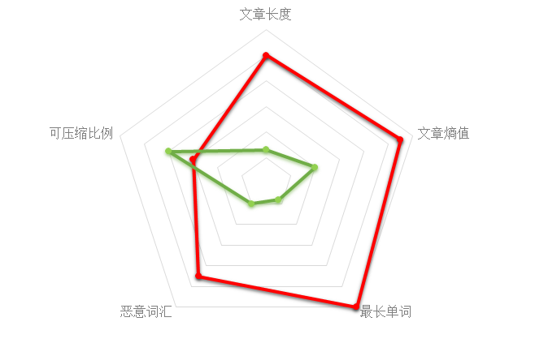

红色代表WebShell，绿色代表正常文件，下面雷同

### 导入画图的库


```python
import seaborn as sns
import matplotlib.pyplot as plt
%matplotlib inline

plt.style.use('seaborn')
sns.set_context("poster")
sns.set(font_scale=2)
pd.set_option('display.max_columns', 500)
```

### 将各个特征以图形化的界面展现出来


```python
sns.kdeplot(dataSet.Length[dataSet.label == 1].values, color="r", shade=True)
sns.kdeplot(dataSet.Length[dataSet.label == 0].values, color="b", shade=True)
```


    <matplotlib.axes._subplots.AxesSubplot at 0x7fb15c8a99e8>


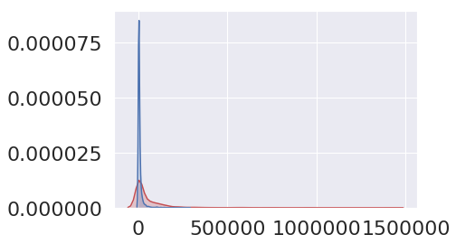


```python
sns.kdeplot(dataSet.Entropy[dataSet.label == 1].values, color="r", shade=True)
sns.kdeplot(dataSet.Entropy[dataSet.label == 0].values, color="b", shade=True)
```


    <matplotlib.axes._subplots.AxesSubplot at 0x7fb15c842588>


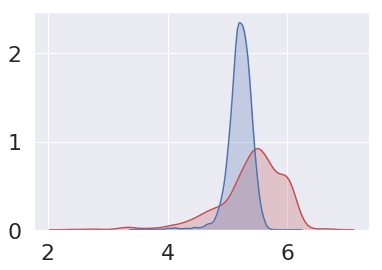


```python
sns.kdeplot(dataSet.LongestWord[dataSet.label == 1].values, color="r", shade=True)
sns.kdeplot(dataSet.LongestWord[dataSet.label == 0].values, color="b", shade=True)
```


    <matplotlib.axes._subplots.AxesSubplot at 0x7fb15c82eb38>


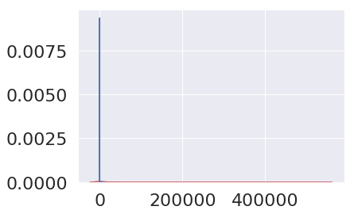


```python
sns.kdeplot(dataSet.SignatureNasty[dataSet.label == 1].values, color="r", shade=True)
sns.kdeplot(dataSet.SignatureNasty[dataSet.label == 0].values, color="b", shade=True)
```


    <matplotlib.axes._subplots.AxesSubplot at 0x7fb15a774dd8>


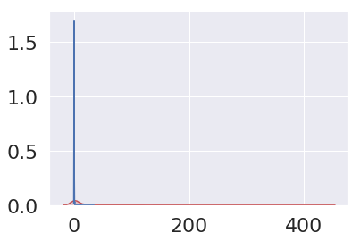


```python
sns.kdeplot(dataSet.Compression[dataSet.label == 1].values, color="r", shade=True)
sns.kdeplot(dataSet.Compression[dataSet.label == 0].values, color="b", shade=True)
```


    <matplotlib.axes._subplots.AxesSubplot at 0x7fb15a6caf60>


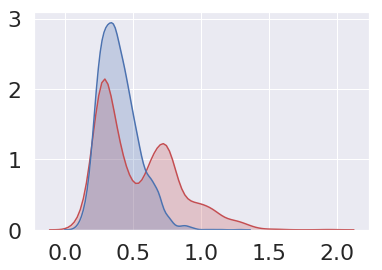


```python
from mpl_toolkits.mplot3d import Axes3D

fig = plt.figure(figsize=(7,5))
ax = Axes3D(fig)
ax.scatter(dataSet.LongestWord[dataSet.label == 1].values, dataSet.Compression[dataSet.label == 1],
           dataSet.Length[dataSet.label == 1].values,c='r')
```


    <mpl_toolkits.mplot3d.art3d.Path3DCollection at 0x7fb15a618908>


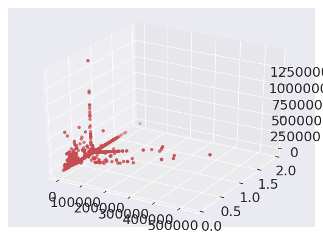


```python
fig = plt.figure(figsize=(7,5))
ax = Axes3D(fig)
ax.scatter(dataSet.LongestWord[dataSet.label == 0].values, dataSet.Compression[dataSet.label == 0],
           dataSet.Length[dataSet.label == 0].values,c='y')
```


    <mpl_toolkits.mplot3d.art3d.Path3DCollection at 0x7fb158c9beb8>


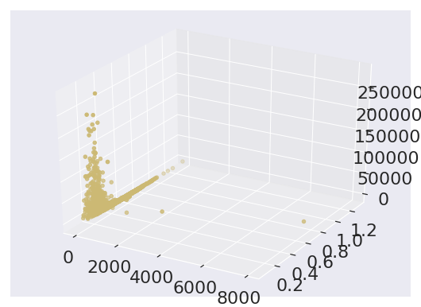


从图片中可以看出大部分的WebShell还是可以被区别出来的

### 计算出各个参数之间的皮尔逊系数


```python
correlations = dataSet.corr()
correlations["label"].sort_values(ascending=False)
```


    label             1.000000
    SignatureNasty    0.391205
    Length            0.330383
    Compression       0.307060
    Entropy           0.251075
    LongestWord       0.219952
    Name: label, dtype: float64


### 按shell占比例将数据均匀分开


```python
from sklearn.model_selection import StratifiedShuffleSplit

split = StratifiedShuffleSplit(n_splits=1, test_size=0.2, random_state=36)
for train_index, test_index in split.split(dataSet, dataSet["label"]):
    train_set = dataSet.loc[train_index]
    test_set = dataSet.loc[test_index]
```


```python
train_set.head(10)
```


<div>
<style scoped>
    .dataframe tbody tr th:only-of-type {
        vertical-align: middle;
    }

    .dataframe tbody tr th {
        vertical-align: top;
    }

    .dataframe thead th {
        text-align: right;
    }
</style>
<table border="1" class="dataframe">
  <thead>
    <tr style="text-align: right;">
      <th></th>
      <th>label</th>
      <th>file</th>
      <th>Length</th>
      <th>Entropy</th>
      <th>LongestWord</th>
      <th>SignatureNasty</th>
      <th>Compression</th>
    </tr>
  </thead>
  <tbody>
    <tr>
      <th>4313</th>
      <td>0</td>
      <td>buf/common/Joomla_3.9.4-Stable-Full_Package/tw...</td>
      <td>4038</td>
      <td>5.136905</td>
      <td>42</td>
      <td>0</td>
      <td>0.309807</td>
    </tr>
    <tr>
      <th>2509</th>
      <td>0</td>
      <td>buf/common/Joomla_3.9.4-Stable-Full_Package/P2...</td>
      <td>1345</td>
      <td>5.223217</td>
      <td>54</td>
      <td>0</td>
      <td>0.259480</td>
    </tr>
    <tr>
      <th>7767</th>
      <td>0</td>
      <td>buf/common/phpmyadmin-master/RelationCleanup.php</td>
      <td>15364</td>
      <td>5.352547</td>
      <td>51</td>
      <td>0</td>
      <td>0.073809</td>
    </tr>
    <tr>
      <th>5180</th>
      <td>0</td>
      <td>buf/common/Joomla_3.9.4-Stable-Full_Package/de...</td>
      <td>1333</td>
      <td>5.224251</td>
      <td>50</td>
      <td>0</td>
      <td>0.439610</td>
    </tr>
    <tr>
      <th>4260</th>
      <td>0</td>
      <td>buf/common/Joomla_3.9.4-Stable-Full_Package/pd...</td>
      <td>966</td>
      <td>5.280909</td>
      <td>40</td>
      <td>0</td>
      <td>0.548654</td>
    </tr>
    <tr>
      <th>4419</th>
      <td>0</td>
      <td>buf/common/Joomla_3.9.4-Stable-Full_Package/jq...</td>
      <td>3753</td>
      <td>5.312287</td>
      <td>47</td>
      <td>0</td>
      <td>0.356515</td>
    </tr>
    <tr>
      <th>3485</th>
      <td>0</td>
      <td>buf/common/Joomla_3.9.4-Stable-Full_Package/in...</td>
      <td>6869</td>
      <td>5.321246</td>
      <td>54</td>
      <td>0</td>
      <td>0.324793</td>
    </tr>
    <tr>
      <th>6366</th>
      <td>0</td>
      <td>buf/common/WordPress-master/content-page (3).php</td>
      <td>884</td>
      <td>5.089887</td>
      <td>32</td>
      <td>0</td>
      <td>0.488688</td>
    </tr>
    <tr>
      <th>1894</th>
      <td>1</td>
      <td>buf/shell/a/php/f3b9d1c8e18467eecb31e0bb2c39c9...</td>
      <td>1449</td>
      <td>5.194428</td>
      <td>122</td>
      <td>0</td>
      <td>0.641822</td>
    </tr>
    <tr>
      <th>72</th>
      <td>1</td>
      <td>buf/shell/bypass-waf-2015-06-16-03.php</td>
      <td>460</td>
      <td>5.464458</td>
      <td>86</td>
      <td>0</td>
      <td>0.645652</td>
    </tr>
  </tbody>
</table>
</div>


```python
train_set.info()
```

    <class 'pandas.core.frame.DataFrame'>
    Int64Index: 6277 entries, 4313 to 6235
    Data columns (total 7 columns):
    label             6277 non-null int64
    file              6277 non-null object
    Length            6277 non-null int64
    Entropy           6277 non-null float64
    LongestWord       6277 non-null int64
    SignatureNasty    6277 non-null int64
    Compression       6277 non-null float64
    dtypes: float64(2), int64(4), object(1)
    memory usage: 392.3+ KB


### 将X，Y分离


```python
x_train = train_set.drop("label", axis=1).drop("file", axis=1)
y_train = train_set.label
x_test = test_set.drop("label", axis=1).drop("file", axis=1)
y_test = test_set.label
```

### 载入性能考核函数，并对结果进行评定


```python
from sklearn.metrics import precision_score, recall_score, f1_score

def score(name, y_test, y_pred):
    accu_score = precision_score(y_test, y_pred)
    reca_score = recall_score(y_test, y_pred)
    fin_score = f1_score(y_test, y_pred)
    print("{}:\n精度：{}\n召回率：{}\n综合得分：{}".format(name, accu_score, reca_score, fin_score))
```

# 分类算法介绍

## 最有影响力的十大数据挖掘算法中包含的分类算法

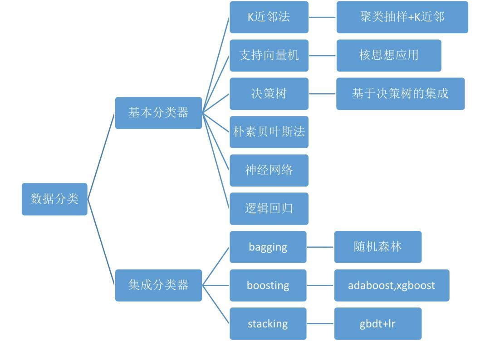

### k近邻算法

K最近邻(k-Nearest Neighbor，KNN)分类算法，是一个理论上比较成熟的方法，也是最简单的机器学习算法之一。该方法的思路是：如果一个样本在特征空间中的k个最相似(即特征空间中最邻近)的样本中的大多数属于某一个类别，则该样本也属于这个类别。

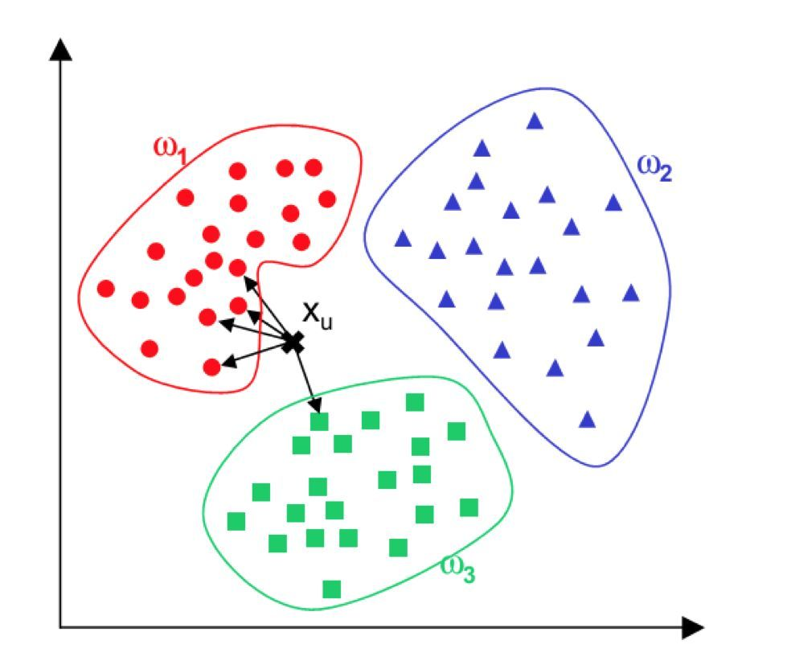

### SVM法

支持向量机(support vector machine)是一种分类算法，通过寻求结构化风险最小来提高学习机泛化能力，实现经验风险和置信范围的最小化，从而达到在统计样本量较少的情况下，亦能获得良好统计规律的目的。通俗来讲，它是一种二类分类模型，其基本模型定义为特征空间上的间隔最大的线性分类器，即支持向量机的学习策略便是间隔最大化，最终可转化为一个凸二次规划问题的求解。


### 决策树

决策树(Decision Tree）是在已知各种情况发生概率的基础上，通过构成决策树来求取净现值的期望值大于等于零的概率，评价项目风险，判断其可行性的决策分析方法，是直观运用概率分析的一种图解法。是一种十分常用的监管学习式分类方法。

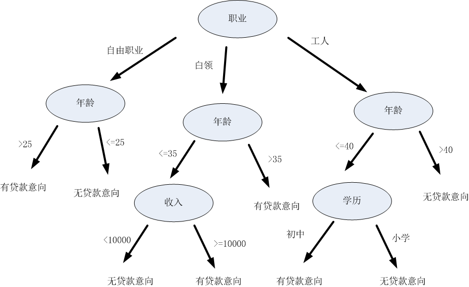

### 朴素贝叶斯

朴素贝叶斯方法是一种监督学习算法，它基于贝叶斯定理给定类变量值的每对特征之间的条件独立性的“简单”假设。在给定类变量$y$和从属特征向量$x_{1}$到$x_{n}$，贝叶斯定理表明了以下关系：

$P(y \mid x_1, \dots, x_n) = \frac{P(y) P(x_1, \dots x_n \mid y)}
                                 {P(x_1, \dots, x_n)}$
                                 
使用简单的条件独立假设

$P(x_i | y, x_1, \dots, x_{i-1}, x_{i+1}, \dots, x_n) = P(x_i | y),$

对于所有$i$，这种关系被简化为

$P(y \mid x_1, \dots, x_n) = \frac{P(y) \prod_{i=1}^{n} P(x_i \mid y)}
                                 {P(x_1, \dots, x_n)}$
                                
由于$P(x_1, \dots, x_n)$在输入时是常数，我们可以使用以下分类规则：

$\begin{align}\begin{aligned}P(y \mid x_1, \dots, x_n) \propto P(y) \prod_{i=1}^{n} P(x_i \mid y)\\\Downarrow\\\hat{y} = \arg\max_y P(y) \prod_{i=1}^{n} P(x_i \mid y),\end{aligned}\end{align}$

我们可以使用最大后验（MAP）估计来估计$$P(y)和$P(x_i \mid y)$; 前者是训练集中$y$类的相对频率。

### 神经网络

神经网络由“神经元”构成，一个“神经元”是一个运算单元f，该运算单元在神经网络中称作激活函数，激活函数通常设定为sigmoid函数（也可以设为其他函数），它可以输入一组加权系数的量，对这个量进行映射，如果这个映射结果达到或者超过了某个阈值，输出一个量。

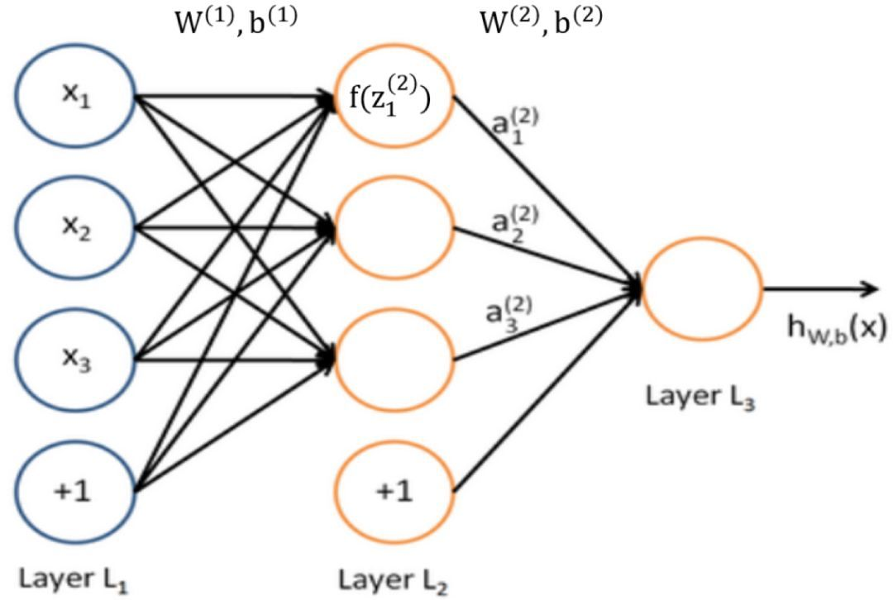

### 逻辑回归

逻辑回归的模型是一个非线性模型，sigmoid函数，又称逻辑回归函数。但它其实是基于线性回归模型，因为除去sigmoid映射函数关系，其他的步骤，算法都是线性回归的。所以可以说，逻辑回归，都是以线性回归为理论支持的。

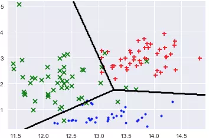

### 随机森林

随机森林是一个包含多个决策树的分类器， 并且其输出的类别是由个别树输出的类别的众数而定。随机森林是集成学习思想下的产物，将许多棵决策树整合成森林，并合起来用来预测最终结果。

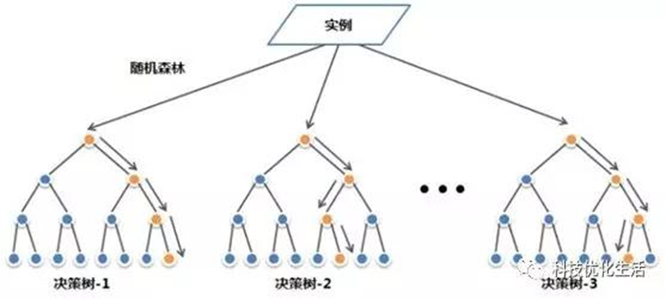

### adaboost

Adaboost是一种迭代算法，其核心思想是针对同一个训练集训练不同的分类器(弱分类器)，然后把这些弱分类器集合起来，构成一个更强的最终分类器（强分类器）。其算法本身是通过改变数据分布来实现的，它根据每次训练集之中每个样本的分类是否正确，以及上次的总体分类的准确率，来确定每个样本的权值。将修改过权值的新数据集送给下层分类器进行训练，最后将每次训练得到的分类器最后融合起来，作为最后的决策分类器。使用adaboost分类器可以排除一些不必要的训练数据特征，并放在关键的训练数据上面。

### xgboost

该算法思想就是不断地添加树，不断地进行特征分裂来生长一棵树，每次添加一个树，其实是学习一个新函数，去拟合上次预测的残差。当我们训练完成得到k棵树，我们要预测一个样本的分数，其实就是根据这个样本的特征，在每棵树中会落到对应的一个叶子节点，每个叶子节点就对应一个分数，最后只需要将每棵树对应的分数加起来就是该样本的预测值。

### gbdt+lr

GBDT算法的图示部分形如一棵倒过来的树，其根部即代表训练GBDT算法的原始数据集，经过树算法对原始数据的切分，可得到代表不同新特征的叶子节点。再将GBDT所得的叶子节点输入LR算法，经过线性分析和sigmoid映射，即可得到模型分类结果。

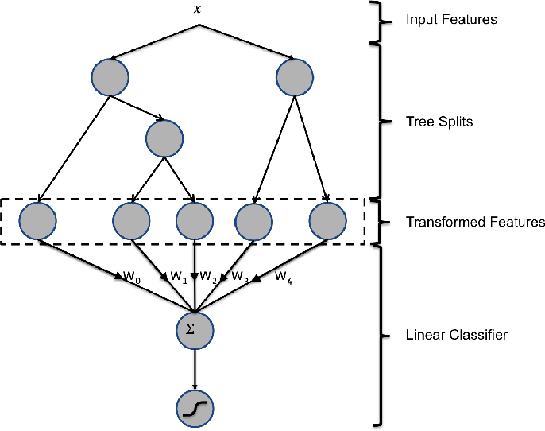

# 分类算法尝试

### K近邻法


```python
from sklearn import neighbors

knc = neighbors.KNeighborsClassifier()
K_model =knc.fit(x_train, y_train)
y_pred = K_model.predict(x_test)

score("k近邻", y_test, y_pred)
```

    k近邻:
    精度：0.8494983277591973
    召回率：0.6397984886649875
    综合得分：0.7298850574712645


### 支持向量机


```python
from sklearn import svm

svc = svm.SVC()
S_model =svc.fit(x_train, y_train)
y_pred = S_model.predict(x_test)

score("支持向量机", y_test, y_pred)
```

    /home/cances/.local/lib/python3.6/site-packages/sklearn/svm/base.py:196: FutureWarning: The default value of gamma will change from 'auto' to 'scale' in version 0.22 to account better for unscaled features. Set gamma explicitly to 'auto' or 'scale' to avoid this warning.
      "avoid this warning.", FutureWarning)


    支持向量机:
    精度：0.9824561403508771
    召回率：0.28211586901763225
    综合得分：0.4383561643835617


### 决策树


```python
from sklearn import tree

dtc = tree.DecisionTreeClassifier()
D_model = dtc.fit(x_train, y_train)
y_pred = D_model.predict(x_test)

score("决策树", y_test, y_pred)
```

    决策树:
    精度：0.9149484536082474
    召回率：0.8942065491183879
    综合得分：0.9044585987261146


### 朴素贝叶斯分类


```python
from sklearn.naive_bayes import GaussianNB

Bayes = GaussianNB()        #高斯朴素贝叶斯
B_model = Bayes.fit(x_train, y_train)
y_pred = B_model.predict(x_test)

score("贝叶斯分类器", y_test, y_pred)
```

    贝叶斯分类器:
    精度：0.9148936170212766
    召回率：0.4332493702770781
    综合得分：0.5880341880341879


### 随机森林


```python
from sklearn.ensemble import RandomForestClassifier

forest_reg = RandomForestClassifier(n_estimators=15, random_state=42, max_features=3)
forest_reg.fit(x_train, y_train)
y_pred = forest_reg.predict(x_test)

score("随机森林", y_test, y_pred)
```

    随机森林:
    精度：0.9625668449197861
    召回率：0.906801007556675
    综合得分：0.933852140077821


### ADABOOST


```python
from sklearn.ensemble import AdaBoostClassifier

ada = AdaBoostClassifier(n_estimators=100,algorithm='SAMME.R')
A_model =ada.fit(x_train, y_train)
y_pred = A_model.predict(x_test)

score("AdaBoost", y_test, y_pred)
```

    AdaBoost:
    精度：0.9105691056910569
    召回率：0.8463476070528967
    综合得分：0.877284595300261


### XGBOOST


```python
import xgboost as xgb

params = {
    'booster': 'gbtree',
    'num_class': 2,               # 类别数，与 multisoftmax 并用
    'gamma': 0.1,                  # 用于控制是否后剪枝的参数,越大越保守，一般0.1、0.2这样子。
    'max_depth': 12,               # 构建树的深度，越大越容易过拟合
    'lambda': 2,                   # 控制模型复杂度的权重值的L2正则化项参数，参数越大，模型越不容易过拟合。
    'subsample': 0.7,              # 随机采样训练样本
    'colsample_bytree': 0.7,       # 生成树时进行的列采样
    'min_child_weight': 3,
    'silent': 1,                   # 设置成1则没有运行信息输出，最好是设置为0.
    'eta': 0.007,
    'seed': 1000,
    'nthread': 4,
}
```


```python
params['eval_metric'] = 'error'
num_round = 200
dtest = xgb.DMatrix( x_test, label=y_test)
dtrain = xgb.DMatrix( x_train, label=y_train)
evallist  = [(dtest,'test'), (dtrain,'train')]
xgbo = xgb.XGBClassifier(max_depth=3, n_estimators=10000, learn_rate=0.01)
xgbo.fit(x_train, y_train)
y_pred = xgbo.predict(x_test)

score("xgboost", y_test, y_pred)
```

    /home/cances/.local/lib/python3.6/site-packages/xgboost/core.py:587: FutureWarning: Series.base is deprecated and will be removed in a future version
      if getattr(data, 'base', None) is not None and \
    /home/cances/.local/lib/python3.6/site-packages/xgboost/core.py:588: FutureWarning: Series.base is deprecated and will be removed in a future version
      data.base is not None and isinstance(data, np.ndarray) \


    xgboost:
    精度：0.9545454545454546
    召回率：0.8992443324937027
    综合得分：0.9260700389105059


### GBDT+LR


```python
from sklearn.ensemble import GradientBoostingClassifier

gbm1 = GradientBoostingClassifier(n_estimators=50, random_state=10, subsample=0.6, max_depth=7,
                                  min_samples_split=900)
G_model =gbm1.fit(x_train, y_train)
y_pred = G_model.predict(x_test)

score("GBDT ", y_test, y_pred)
```

    GBDT :
    精度：0.9351351351351351
    召回率：0.871536523929471
    综合得分：0.9022164276401564


### 投票算法


```python
from sklearn.ensemble import VotingClassifier

vot = VotingClassifier(
    estimators = [('F', forest_reg), ('X', xgbo)],
    voting = 'soft'
)
```


```python
v_model = vot.fit(x_train, y_train)
y_pred = v_model.predict(x_test)

score("Voting", y_test, y_pred)
```

    Voting:
    精度：0.9624664879356568
    召回率：0.9042821158690176
    综合得分：0.9324675324675323


# 对随机森林进行参数优化测试

### Estimators参数调整


```python
A_score = []
R_score = []
F_score = []

for i in range(1, 30):
    forest_reg = RandomForestClassifier(n_estimators=i, random_state=42, max_features=2)
    forest_reg.fit(x_train, y_train)
    y_pred = forest_reg.predict(x_test)
    A_score.append(precision_score(y_test, y_pred))
    R_score.append(recall_score(y_test, y_pred))
    F_score.append(f1_score(y_test, y_pred))
```


```python
plt.plot(range(1,30), A_score, c='r')
plt.plot(range(1,30), R_score, c= 'g')
plt.plot(range(1,30), F_score, ls='--')
```


    [<matplotlib.lines.Line2D at 0x7fb149b3c898>]


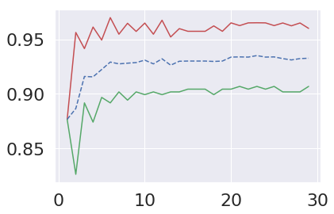


### features参数调整


```python
A_score = []
R_score = []
F_score = []

for i in range(1, 5):
    forest_reg = RandomForestClassifier(n_estimators=11, random_state=42, max_features=i)
    forest_reg.fit(x_train, y_train)
    y_pred = forest_reg.predict(x_test)
    A_score.append(precision_score(y_test, y_pred))
    R_score.append(recall_score(y_test, y_pred))
    F_score.append(f1_score(y_test, y_pred))
```


```python
plt.plot(range(1, 5), A_score, c='r')
plt.plot(range(1, 5), R_score, c= 'g')
plt.plot(range(1, 5), F_score, ls='--')
```


    [<matplotlib.lines.Line2D at 0x7fb149b13470>]


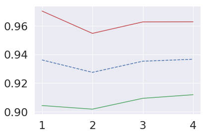


# 尾声

### 确定最终模型并将训练结果存储起来


```python
from sklearn.externals import joblib

forest_reg = RandomForestClassifier(n_estimators=11, random_state=42, max_features=2)
last_model = forest_reg.fit(x_train, y_train)
joblib.dump(last_model, "model.pkl")
```


    ['model.pkl']


### 读取模型的方法


```python
from sklearn.externals import joblib

joblib.load("model.pkl")
```


    RandomForestClassifier(bootstrap=True, class_weight=None, criterion='gini',
                max_depth=None, max_features=2, max_leaf_nodes=None,
                min_impurity_decrease=0.0, min_impurity_split=None,
                min_samples_leaf=1, min_samples_split=2,
                min_weight_fraction_leaf=0.0, n_estimators=11, n_jobs=None,
                oob_score=False, random_state=42, verbose=0, warm_start=False)


最后还有一个验证集部分，因为代码写的比较乱就不放上来了，结果还不错，大部分马都没能逃过模型的“法眼”。除了网站安装文件被误报其他的没有毛病了。安装文件本来也就有很大的权限，而且正常运营的网站也不应该存在安装文件，防止被重置网站，这样我的模型还有了一个可以检测安装文件是否被删除的附加功能，很满意。。。。
